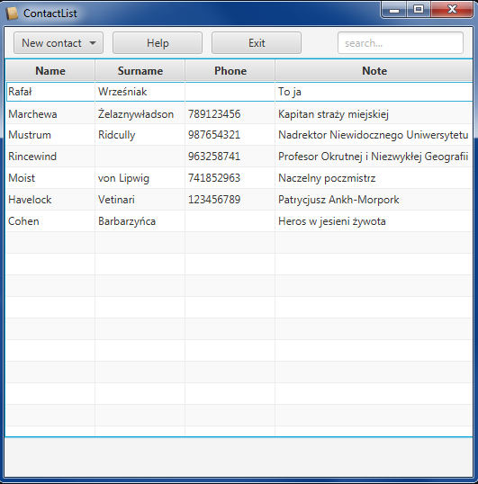
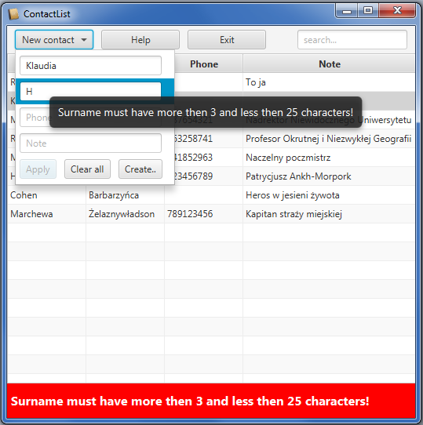
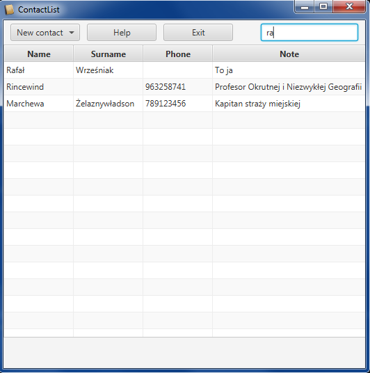
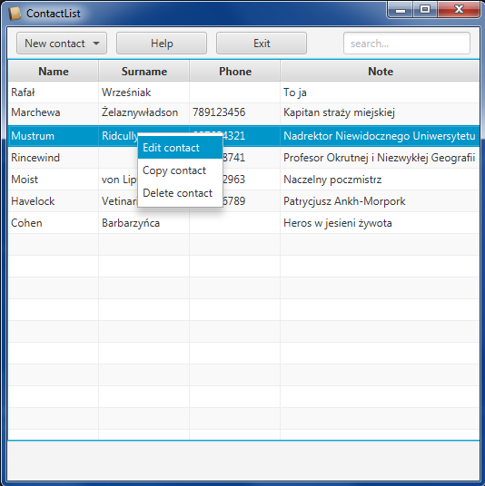
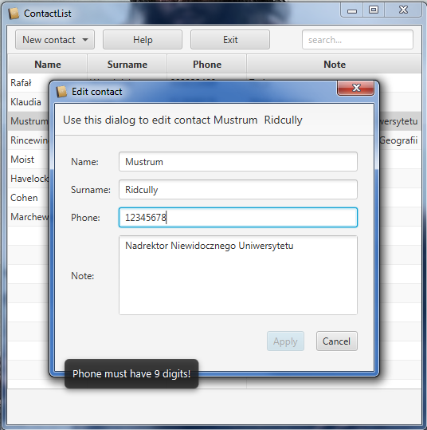
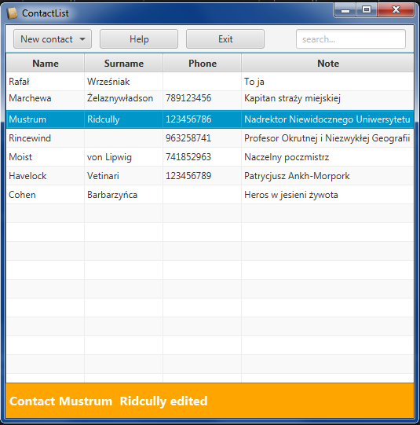
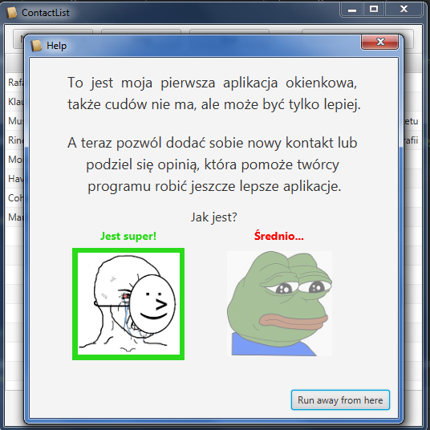

# Contact List application
#### This application is for managing contacts. There is possibility to create new contacts, edit existing ones and delete them. Everything is saved into xml file. There are several options that helps in managing all this like searching for contacts text field and animation with information about errors and done actions.

## Some examples:

Main window:

Adding new contact from pop up with information what is need to be fixed:

Searching:

Context menu:

Edit window:

After editing:

Help window:

